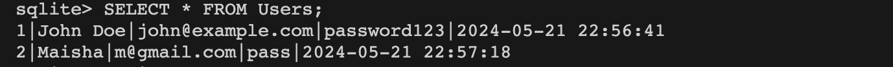
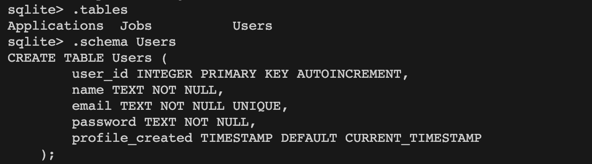
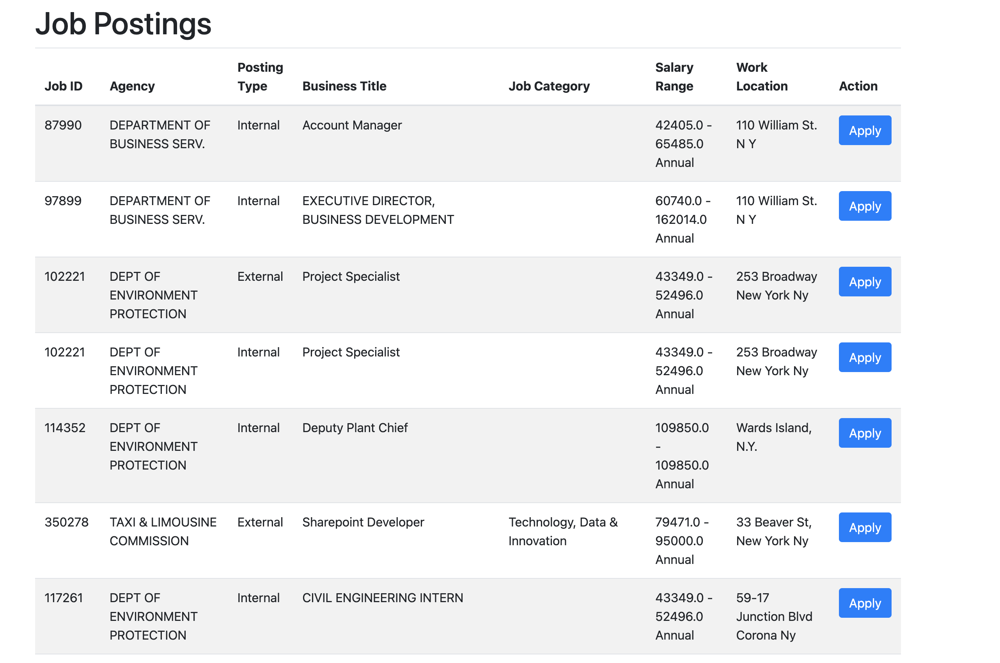

# Databases-cs338
Final project for CS 338 


# Technologies:
Backend: Python, Flask, SQLite
Frontend: Tailwind CSS, HTML, and potentially React if time permits, to create a smoother user interface.


# Getting started 

1. Create  a virtual environment using ```python3 -m venv env ``` and ```source env/bin/activate```
2. clone this repo and install the requirements using ```pip install -r requirements```
3. run ```python app.py```


# Using the Database
The repository includes a pre-populated SQLite database file (job_portal.db). The application is configured to use this file by default. If you want to inspect the database, you can use tools like SQLite CLI. 

# To use the SQlite CLI

1. go to the directory where the .db is located 
2. run ```sqlite3 job_portal.db``` (make sure you have sqlite installed)
3. To see the list of table run ```.tables```
4. To see the records in the users run ```SELECT * FROM Users;```

# Screenshots





# Current Feature supports 
A nice front end in that allows the user to view all job posting and apply to a job, furthermore, we have also added a trigger to avoid duplicate applications in job postings. 


# Tables 
Currently has 5 tables Applicants, Applications, Employers, JobPostings and Users    
# Files 

Applicants_sample.csv : A sample output of what the Applicants table looks like
Applications_sample.csv: A sample output of what the Applications table looks like
Employers_sample.csv: A sample output of what the Employers table looks like
JobPostings_sample.csv: A sample output of what the JobPostings table looks like
Users_sample.csv: A sample output of what the Users table looks like
pop_app.py: Script to populate the applicant and application tables
pop_data.py: Script to Jobpostings table
pop_employers.py: Script to populate the Employers table
init_db.py: Script to initialising the database 
applicants.py: Script to create sample synthetic data of applicants


