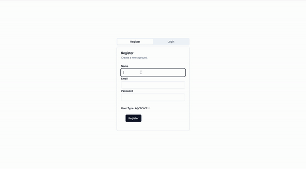
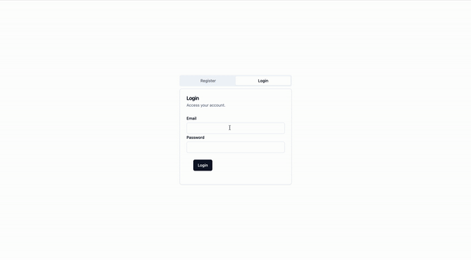
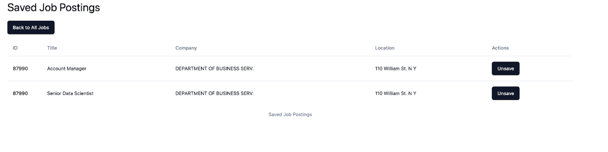
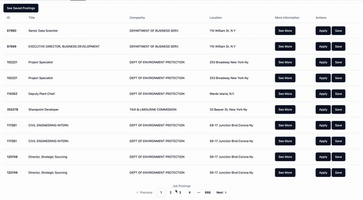
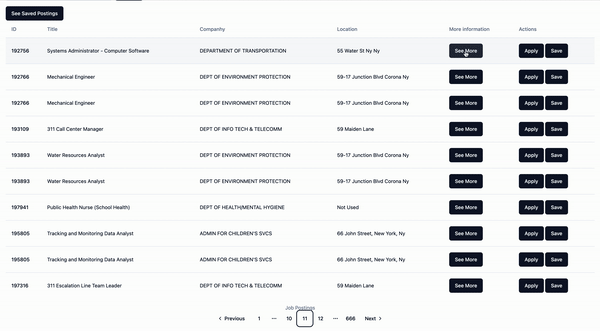

# Databases-cs338
Final project for CS 338 


# Technologies:
Backend: Python, Flask, SQLite
Frontend: Tailwind CSS, HTML, and potentially React if time permits, to create a smoother user interface.


# Getting started 
## Backend

1. Create  a virtual environment using ```python3 -m venv env ``` and ```source env/bin/activate```
2. clone this repo and install the requirements using ```pip install -r requirements```
3. run ```python app.py```

## Frontend 

On another terminal:
1. Go to the frontend directory  ```cd frontend```
2. Run ```npm run dev```

Note: Make sure the frontend and backend are running on two different ports


# Using the Database
The repository includes a pre-populated SQLite database file (job_portal.db). The application is configured to use this file by default. If you want to inspect the database, you can use tools like SQLite CLI. 

# To use the SQlite CLI

1. go to the directory where the .db is located 
2. run ```sqlite3 job_portal.db``` (make sure you have sqlite installed)
3. To see the list of table run ```.tables```
4. To see the records in the users run ```SELECT * FROM Users;```

# Screenshots


# Current Feature supports 

## Milestone 1 
A nice front end in that allows the user to view all job posting and apply to a job, furthermore, we have also added a trigger to avoid duplicate applications in job postings. 


## Milestone 2 
We used Sveltekit and Shadcn components for a nicer finish!

### Registration  


### Log in  


### Search


### Saved jobs



# Fancy Features 


- Beautiful interface design, we use a frontend framework called Svelte with Shadcn/ui components for smooth interface and responsiveness even in mobile! 
- We include pagination so only 10 job postings can be seen at a time 



- Since our dataset has a lot of information on each job and it would make the table messy, a user is able to click on the button see more so see most of the information of the job




# Tables 
Currently has 6 tables Applicants, Applications, Employers, JobPostings,  Users, SavedJobPostings    

# Files 

**Applicants_sample.csv** : A sample output of what the Applicants table looks like

**Applications_sample.csv** : A sample output of what the Applications table looks like

**Employers_sample.csv** : A sample output of what the Employers table looks like

**JobPostings_sample.csv** : A sample output of what the JobPostings table looks like

**Users_sample.csv** : A sample output of what the Users table looks like

**pop_app.py** : Script to populate the applicant and application tables

**pop_data.py** : Script to Jobpostings table

**pop_employers.py** : Script to populate the Employers table

**init_db.py** : Script to initialising the database 

**applicants.py** : Script to create sample synthetic data of applicants

**test-sample.sql** : Sql samples to test out code 

**test-sample.out**: output of the samples 


**test-production.sql** :  test production sql 

**test-production.out**: output of the production data 

**generate-sample.py**: simple script to generate all the test-sample.sql queries and show it's output in the test-sample.out

**members.md**: Our member contributions so far 


